# Репозиторий для сдачи *лабораторных работ* по Программированию и Алгоритмизации

***

## Меня зовут Касторнов Артём из группы Бивт 26-6-5 тут будут лабораторные работы


## Лабораторная работа №1

### 1 Задание - Привет и возраст
**Файл:** `src/01_greeting.py`

**Ввод:** имя(строка),возраст(целое)

**Вывод:** `Привет, <имя>! Через год тебе будет <возраст+1>`

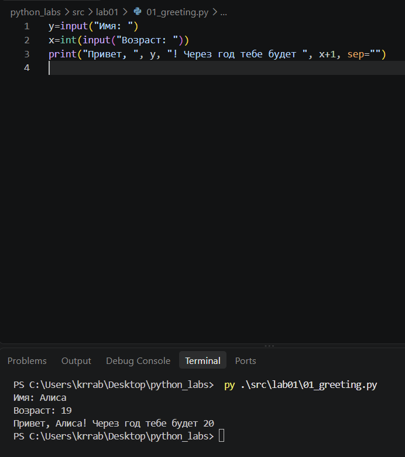


### 2 Задание — Сумма и среднее
**Файл:** `src/01_sum_avg.py`

**Ввод:** два числа (вещественные), допускаются **точка или запятая**.

**Вывод:** `sum=<...>; avg=<...>` **— значения печатать с 2 знаками**.

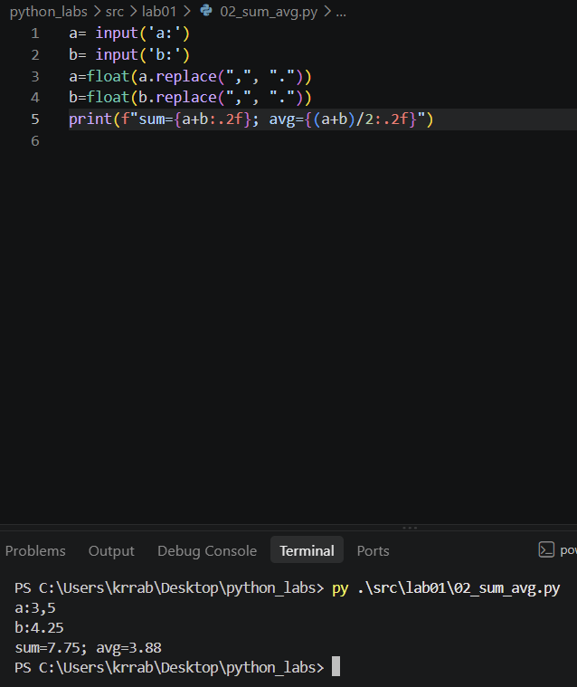


### 3 Задание — Чек: скидка и НДС

**Файл:** `src/03_discount_vat.py`

**Ввод:** `price` (₽), `discount` (%), `vat` (%) — вещественные.

**Формулы:**
`base = price * (1 - discount/100)`
`vat_amount = base * (vat/100)`
`total = base + vat_amount`

**Вывод:** по строкам, **2 знака** после запятой.

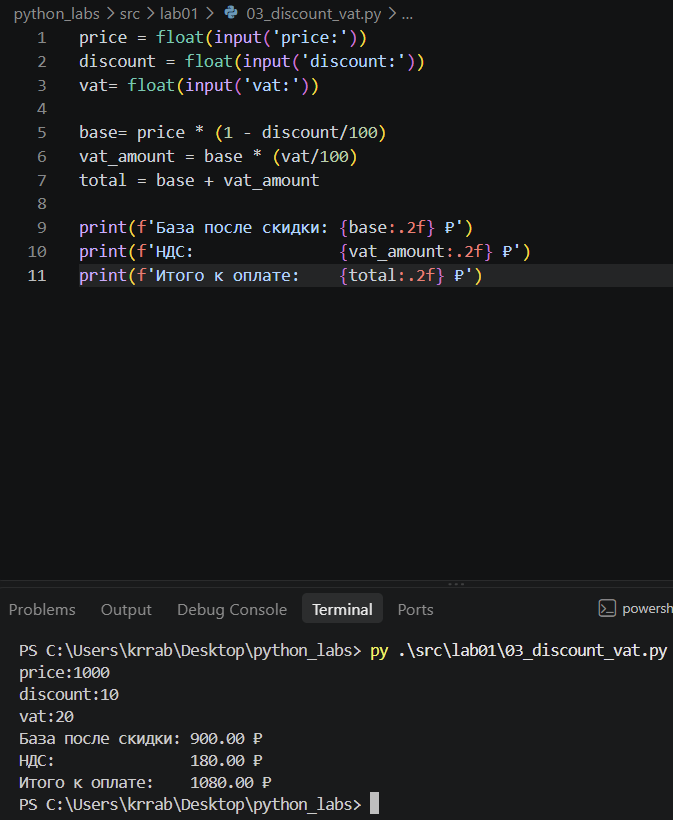


### 4 Задание — Минуты → ЧЧ:ММ

**Файл:** `src/04_minutes_to_hhmm.py`

**Ввод:** `m` — целые минуты.

**Вывод:** `ЧЧ:ММ` минуты вывести как `{min:02d}`.

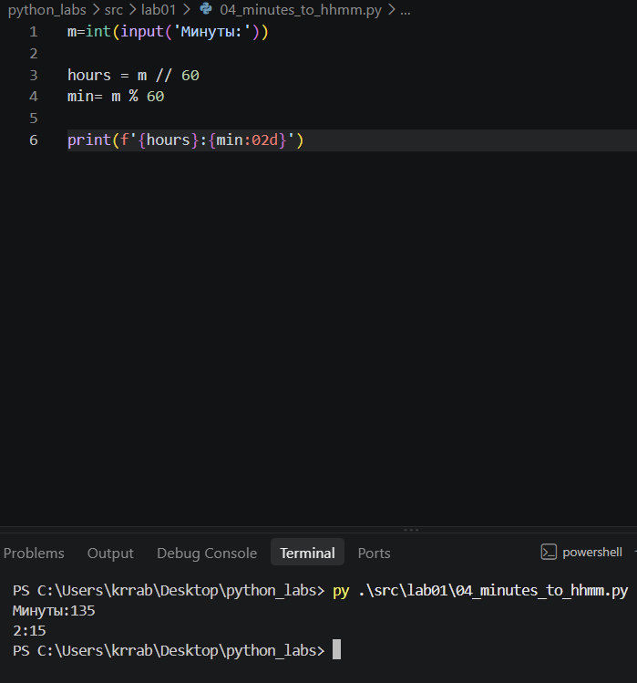

### 5 Задание — Инициалы и длина строки

**Файл:** `src/05_initials_and_len.py`

**Ввод:** ФИО одной строкой (могут быть лишние пробелы).

**Вывод:** инициалы (верхний регистр) и длина исходной строки без лишних пробелов 

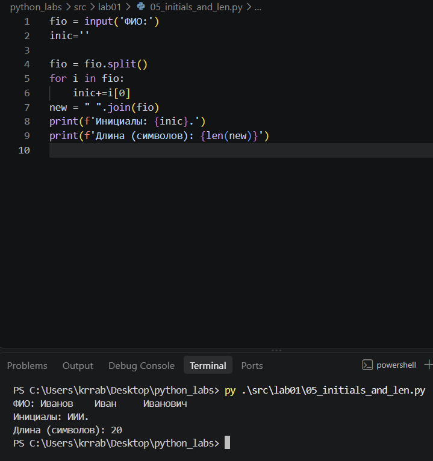

### 6 Задание — Очное/заочное посещение

**Файл:** `src/06_och_zaoch.py`

**Ввод:** подаётся число `N`, после которой идёт `N` строк, каждая формата
>Фамилия Имя Возраст Формат_участия

**Вывод:** посчитать, сколько человек записалось на очный формат и сколько на заочный и вывести два числа через пробел.

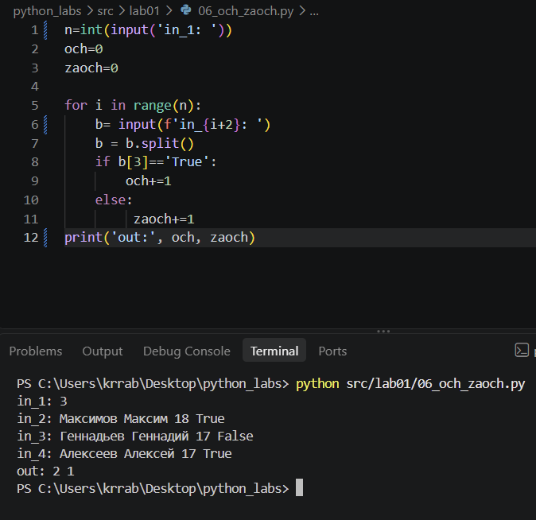


## Лабораторная работа №2 — коллекции и матрицы (list/tuple/set/dict)

### 1 Задание - `arrays.py`

#### `min_max(nums: list[float | int]) -> tuple[float | int, float | int]`

Вернуть кортеж `(минимум, максимум)`. Если список пуст — `ValueError`.

```python 
def min_max(nums: list[float | int]) -> tuple[float | int, float | int]:
    a= -100000
    b= 100000
    if len(nums)==0:
        raise ValueError("Список пуст")
    for i in range(len(nums)):
        if nums[i]<b:
            b=nums[i]
        if nums[i]>a:
            a=nums[i]
    return b, a

print('min_max')
print(f'[3, -1, 5, 5, 0] → {min_max([3, -1, 5, 5, 0])}')
print(f'[42] → {min_max([42])}')
print(f'[-5, -2, -9] → {min_max([-5, -2, -9])}')
print(f'[1.5, 2, 2.0, -3.1] → {min_max([1.5, 2, 2.0, -3.1])}')
print(f'[] → {min_max([])}') 
```

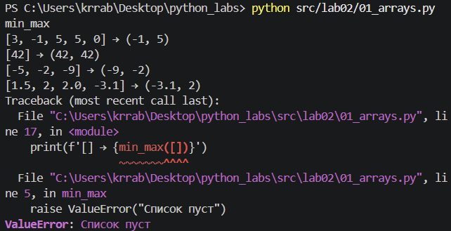

#### `unique_sorted(nums: list[float | int]) -> list[float | int]`

Вернуть **отсортированный** список **уникальных** значений (по возрастанию).
```python 
def unique_sorted(nums: list[float | int]) -> list[float | int]:
    res = []
    for i in nums:
        if i not in res:
            res.append(i)
    for i in range(len(res)):
        for j in range(len(res)-1 -i):
            if res[j]>res[j+1]:
                res[j], res[j+1] = res[j+1], res[j]
    return res

print('unique_sorted')
print(f'[3, 1, 2, 1, 3] → {unique_sorted([3, 1, 2, 1, 3])}')
print(f'[] → {unique_sorted([])}')
print(f'[-1, -1, 0, 2, 2] → {unique_sorted([-1, -1, 0, 2, 2])}')
print(f'[1.0, 1, 2.5, 2.5, 0] → {unique_sorted([1.0, 1, 2.5, 2.5, 0])}')
```

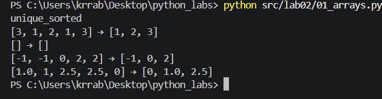

#### '`flatten(mat: list[list | tuple]) -> list`

«Расплющить» список списков/кортежей в один список по строкам (row-major). Если встретилась строка/элемент, который не является списком/кортежем — `TypeError`.
```python
def flatten(mat: list[list | tuple]) -> list:
    res=[]
    for i in mat:
        if type(i)== list or type(i)== tuple:
            for new in i:
                res.append(new)
        else:
            raise TypeError
    return res

print('flatten')
print(f'[[1, 2], [3, 4]] → {flatten([[1, 2], [3, 4]])}')
print(f'[[1, 2], (3, 4, 5)] → {flatten([[1, 2], (3, 4, 5)])}')
print(f'[[1], [], [2, 3]] → {flatten([[1], [], [2, 3]])}')
print(f'[[1, 2], "ab"] → {flatten([[1, 2], "ab"])}')
```

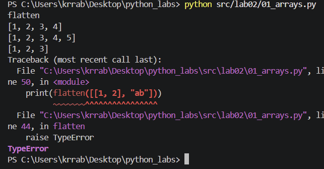

### 2 Задание - `matrix.py`

#### `transpose(mat: list[list[float | int]]) -> list[list]`
Поменять строки и столбцы местами. Пустая матрица `[]` → `[]`.
Если матрица «рваная» (строки разной длины) — `ValueError`.

```python
def transpose(mat: list[list[float | int]]) -> list[list]:
    res=[]
    if mat == []:
        return []
    row_len = len(mat[0])
    for row in mat:
        if len(row) != row_len:
            raise ValueError('рваная матрица')
    for col in range(row_len):
        new_row = []
        for row in mat:
            new_row.append(row[col])
        res.append(new_row)
    return res

print('transpose')
print(f'[[1, 2, 3]] → {transpose([[1, 2, 3]])}')
print(f'[[1], [2], [3]] → {transpose([[1], [2], [3]])}')
print(f'[[1, 2], [3, 4]] → {transpose([[1, 2], [3, 4]])}')
print(f'[] → {transpose([])}')
print(f'[[1, 2], [3]] → {transpose([[1, 2], [3]])}')
```

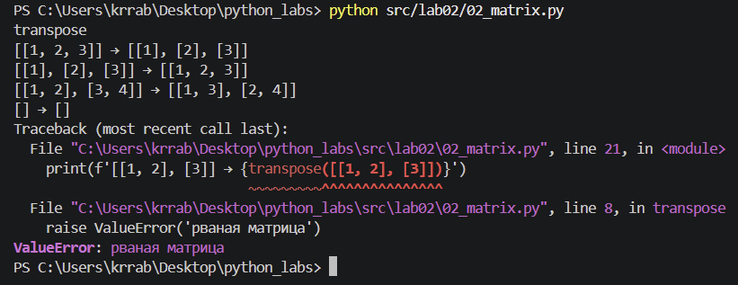

#### `row_sums(mat: list[list[float | int]]) -> list[float]`
Сумма по каждой строке. Требуется прямоугольность.

```python
def row_sums(mat: list[list[float | int]]) -> list[float]:
    row_len = len(mat[0])
    res=[]
    for row in mat:
        if len(row) != row_len:
            raise ValueError('рваная матрица')
    for row in mat:
        res.append(sum(row))
    return res

print('row_sums')
print(f'[[1, 2, 3], [4, 5, 6]] → {row_sums([[1, 2, 3], [4, 5, 6]])}')
print(f'[[-1, 1], [10, -10]] → {row_sums([[-1, 1], [10, -10]])}')
print(f'[[0, 0], [0, 0]] → {row_sums([[0, 0], [0, 0]])}')
print(f'[[1, 2], [3]] → {row_sums([[1, 2], [3]])}')
```

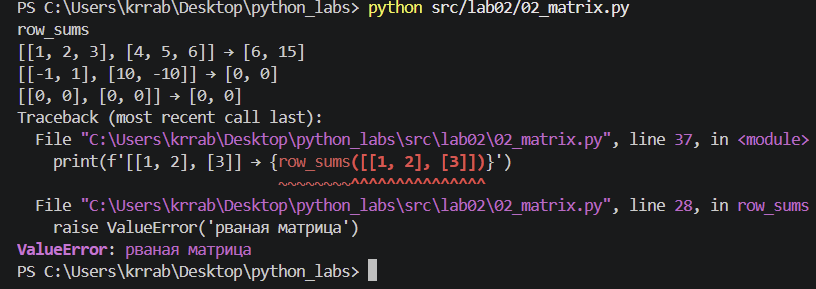

#### `col_sums(mat: list[list[float | int]]) -> list[float]`
Сумма по каждому столбцу. Требуется прямоугольность.
```python
def col_sums(mat: list[list[float | int]]) -> list[float]:
    row_len = len(mat[0])
    res=[]
    for row in mat:
        if len(row) != row_len:
            raise ValueError('рваная матрица')
    for i in range(row_len):
        res.append(sum(row[i] for row in mat))
    return res

print('col_sums')
print(f'[[1, 2, 3], [4, 5, 6]] → {col_sums([[1, 2, 3], [4, 5, 6]])}')
print(f'[[-1, 1], [10, -10]] → {col_sums([[-1, 1], [10, -10]])}')
print(f'[[0, 0], [0, 0]] → {col_sums([[0, 0], [0, 0]])}')
print(f'[[1, 2], [3]] → {col_sums([[1, 2], [3]])}')
```
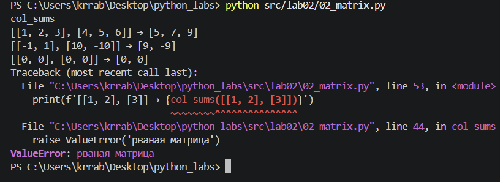

### 3 Задание — `tuples.py`
Работаем с «записями» как с кортежами.
 1.Определите тип записи студента как кортеж:
  `(fio: str, group: str, gpa: float)`
 2.Реализуйте `format_record(rec: tuple[str, str, float]) -> str`
   Вернуть строку вида:
  `Иванов И.И., гр. BIVT-25, GPA 4.60`
  
```python
def format_record(rec: tuple[str, str, float]) -> str:
    if type(rec) != tuple:
        raise TypeError("Не кортеж")

    if len(rec) != 3:
        raise ValueError('В кортеже должно быть 3 элемента')

    fio, group, gpa = rec
    if type(fio) != str or type(group)!=str:
        raise TypeError("Фио или группа не строки")

    if type(gpa)!= float:
        raise TypeError('gpa не цифра')
    
    if gpa<0.0 or gpa> 5.0:
        raise ValueError('gpa должны быть от 0.0 до 5.0')

    fio = " ".join(fio.split())
    group = group.strip()

    if len(fio)==0 or len(group)==0:
        raise ValueError("Фио или группа пусты")

    parts = fio.split()

    if len(parts) < 2 or len(parts) > 3:
        raise ValueError('Фио должно содержать 2 или 3 слова')

    surname= parts[0].capitalize()
    newfio=''
    newfio+= surname + ' '
    for init in parts[1:]:
        newfio += init[0].upper() + '.'
    return f'{newfio}, гр. {group}, GPA {gpa:.2f}' 

print(f'("Иванов Иван Иванович", "BIVT-25", 4.6) → {format_record(("Иванов Иван Иванович", "BIVT-25", 4.6))}')
print(f'("Петров Пётр", "IKBO-12", 5.0) → {format_record(("Петров Пётр", "IKBO-12", 5.0))}')
print(f'("Петров Пётр Петрович", "IKBO-12", 5.0) → {format_record(("Петров Пётр Петрович", "IKBO-12", 5.0))}')
print(f'("  сидорова  анна   сергеевна ", "ABB-01", 3.999) → {format_record(("  сидорова  анна   сергеевна ", "ABB-01", 3.999))}')
```
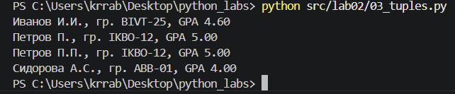